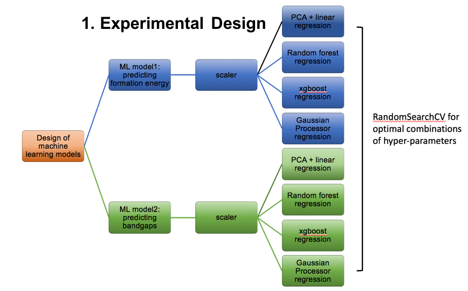
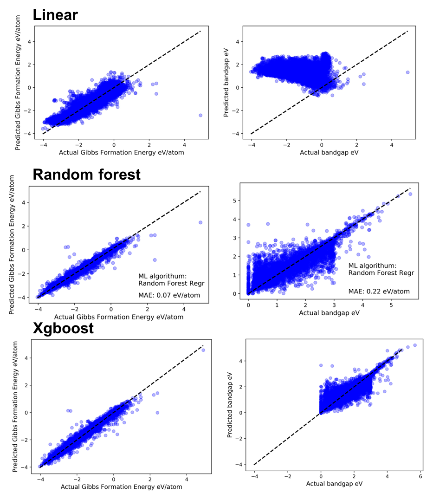
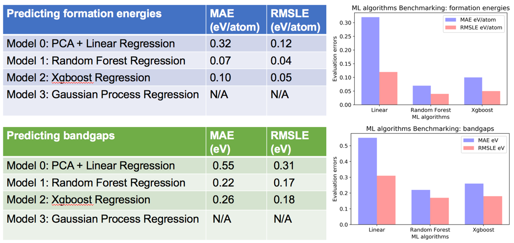

# ML_aided_materials_properties_prediction

## Objective: Accurately Predict the Key Chemical Properties of Crystalline Materials
 
This project is to accurately predict two chemical properties: formation energy and bandgap. Therefore, two regression models are needed as two targets are independent and the values of both targets are continuous. Three regression algorithms(linear regression, random forest and Xgboost) will be used to train the model and their performances are benchmarked. The prediction accuracy is evaluated by both root mean squared logarithmic error (RMSLE) and mean absolute error (MAE), where the lower both the values the better the prediction accuracies. The structural-properties relationships and any promising transparent conductor candidates found from the model are valuable to the companies manufacturing electronic devices. They can use these information as a starting point/shortcut to conduct further advanced experiments, performance tests and manufacturing scale-up , which tremendously reduces their time of trial-and-error.

### Machine learning Design of Experiments:

### Machine learning Design of Experiments:

### Benchmarking Three Machine learning Algorithms:

